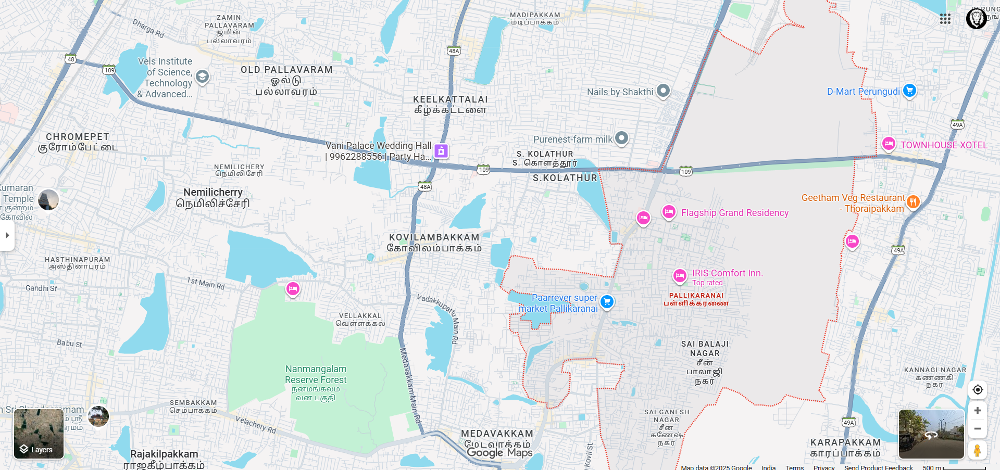
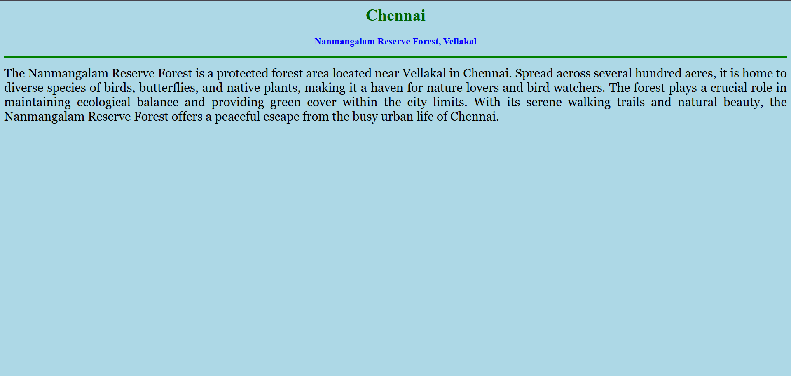
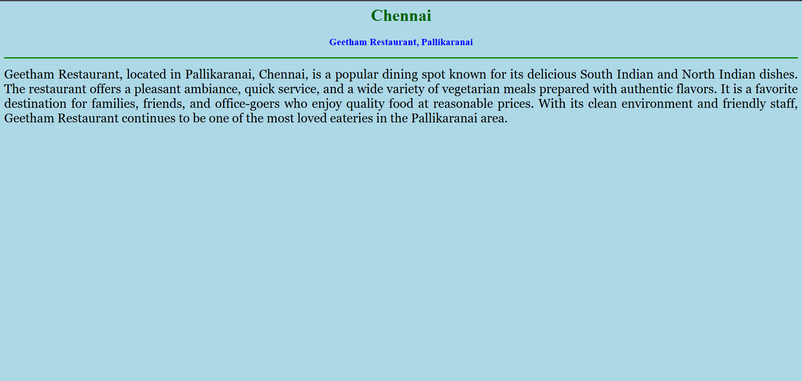
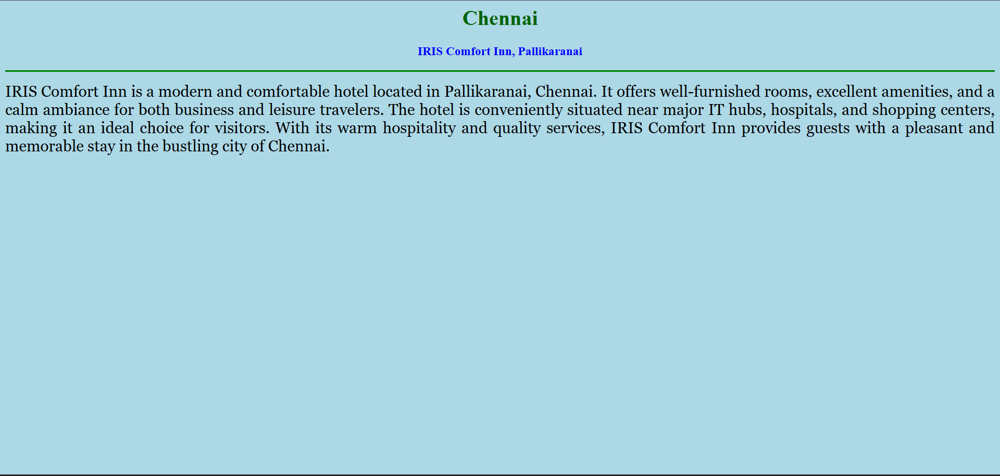
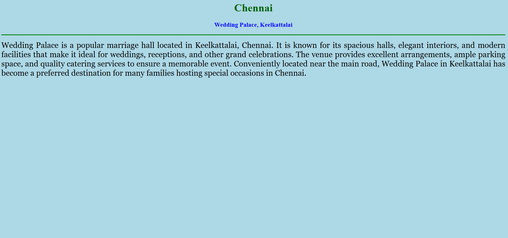

# Ex04 Places Around Me
## Date: 07.10.2025

## AIM
To develop a website to display details about the places around my house.

## DESIGN STEPS

### STEP 1
Create a Django admin interface.

### STEP 2
Download your city map from Google.

### STEP 3
Using ```<map>``` tag name the map.

### STEP 4
Create clickable regions in the image using ```<area>``` tag.

### STEP 5
Write HTML programs for all the regions identified.

### STEP 6
Execute the programs and publish them.

## CODE
~~~
map.html

<html>
<head>
<title>My City</title>
</head>
<body>
<h1 align="center">
<font color="red"><b>pallikaranai</b></font>
</h1>
<h3 align="center">
<font color="blue"><b>S Tozer Theophilus(25016814)</b></font>
</h3>
<center>
<!-- Image Map Generated by http://www.image-map.net/ -->


<map name="image-map">
    <area target="_self" alt="pallikaranai" title="pallikaranai" href="IRISComfortinn.html" coords="1488,562,1274,500" shape="rect">
    <area target="_self" alt="keelkattai" title="keelkattai" href="Weddingpalace.html" coords="645,253,866,314" shape="rect">
    <area target="_self" alt="pallikaranai" title="pallikaranai" href="GeethamRestaurant.html" coords="1557,348,1773,418" shape="rect">
    <area target="_self" alt="vellakal" title="vellakal" href="Forest.html" coords="485,595,781,832" shape="rect">
</center>
</body>
</html>

forest.html

<html>
<head>
  <title>My Home Town</title>
</head>
<body bgcolor="lightblue">

  <h1 align="center">
    <font color="darkgreen"><b>Chennai</b></font>
  </h1>

  <h3 align="center">
    <font color="blue"><b>Nanmangalam Reserve Forest, Vellakal</b></font>
  </h3>

  <hr size="3" color="green">

  <p align="justify">
    <font face="Georgia" size="5">
      The Nanmangalam Reserve Forest is a protected forest area located near Vellakal in Chennai. 
      Spread across several hundred acres, it is home to diverse species of birds, butterflies, and 
      native plants, making it a haven for nature lovers and bird watchers. The forest plays a crucial 
      role in maintaining ecological balance and providing green cover within the city limits. 
      With its serene walking trails and natural beauty, the Nanmangalam Reserve Forest offers a peaceful 
      escape from the busy urban life of Chennai.
    </font>
  </p>

</body>
</html>

GeethamRestaurant.html

<html>
<head>
  <title>My Home Town</title>
</head>
<body bgcolor="lightblue">

  <h1 align="center">
    <font color="darkgreen"><b>Chennai</b></font>
  </h1>

  <h3 align="center">
    <font color="blue"><b>Geetham Restaurant, Pallikaranai</b></font>
  </h3>

  <hr size="3" color="green">

  <p align="justify">
    <font face="Georgia" size="5">
      Geetham Restaurant, located in Pallikaranai, Chennai, is a popular dining spot 
      known for its delicious South Indian and North Indian dishes. The restaurant 
      offers a pleasant ambiance, quick service, and a wide variety of vegetarian meals 
      prepared with authentic flavors. It is a favorite destination for families, friends, 
      and office-goers who enjoy quality food at reasonable prices. With its clean environment 
      and friendly staff, Geetham Restaurant continues to be one of the most loved eateries 
      in the Pallikaranai area.
    </font>
  </p>

</body>
</html>

IRISComfortinn.html

<html>
<head>
  <title>My Home Town</title>
</head>
<body bgcolor="lightblue">

  <h1 align="center">
    <font color="darkgreen"><b>Chennai</b></font>
  </h1>

  <h3 align="center">
    <font color="blue"><b>IRIS Comfort Inn, Pallikaranai</b></font>
  </h3>

  <hr size="3" color="green">

  <p align="justify">
    <font face="Georgia" size="5">
      IRIS Comfort Inn is a modern and comfortable hotel located in Pallikaranai, Chennai. 
      It offers well-furnished rooms, excellent amenities, and a calm ambiance for both business 
      and leisure travelers. The hotel is conveniently situated near major IT hubs, hospitals, 
      and shopping centers, making it an ideal choice for visitors. With its warm hospitality 
      and quality services, IRIS Comfort Inn provides guests with a pleasant and memorable stay 
      in the bustling city of Chennai.
    </font>
  </p>

</body>
</html>

Weddingpalace.html

<html>
<head>
  <title>My Home Town</title>
</head>
<body bgcolor="lightblue">

  <h1 align="center">
    <font color="darkgreen"><b>Chennai</b></font>
  </h1>

  <h3 align="center">
    <font color="blue"><b>Wedding Palace, Keelkattalai</b></font>
  </h3>

  <hr size="3" color="green">

  <p align="justify">
    <font face="Georgia" size="5">
      Wedding Palace is a popular marriage hall located in Keelkattalai, Chennai. 
      It is known for its spacious halls, elegant interiors, and modern facilities 
      that make it ideal for weddings, receptions, and other grand celebrations. 
      The venue provides excellent arrangements, ample parking space, and quality 
      catering services to ensure a memorable event. Conveniently located near the 
      main road, Wedding Palace in Keelkattalai has become a preferred destination 
      for many families hosting special occasions in Chennai.
    </font>
  </p>

</body>
</html>


~~~

## OUTPUT








## RESULT
The program for implementing image maps using HTML is executed successfully.
